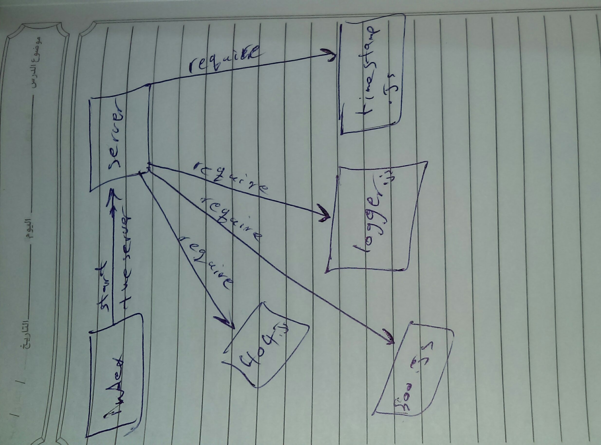

# lab-02

## api-server

### Author: Yousef AlShun

### Links and Resources

- [class06 PR](https://github.com/yousef-401-advanced-javascript/api-server/pull/2)
- [swaggerHub URL](https://app.swaggerhub.com/apis/yousef-97/AOS2-allmethods/0.1)

### Modules
- `express`
- `supertest`

<!-- ##### EXported Values and Methods -->

<!-- ##### `classes`
- input return objects 
- notes return the note value -->

### Setup

#### How to initialize/run your application

json-server --watch ./data/db.json

#### UML

